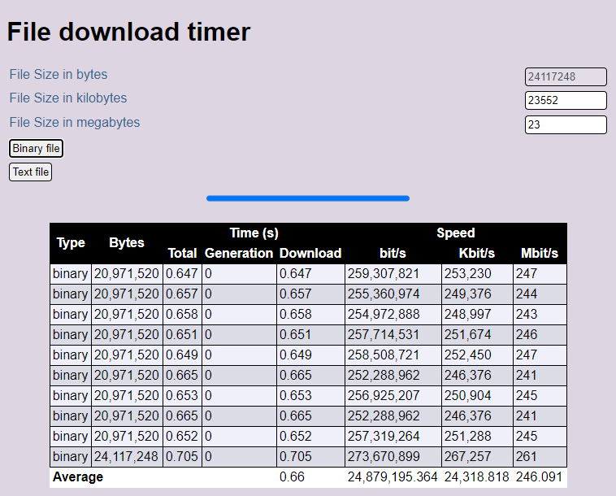

# Download speed tester
This project consists of a file generator which can do both text and binary files. 
To use it, basically you: 
* Put it on your server
* Load up the html page
* Request a filesize, it generates a file with random data and times the download...
* Read the speed it was generated at, and the download time in kilobits & megabits per second

## How it works

### Data generation
For Binary files it relies on PHP's `random_bytes` function, which actually works quite fast to generate bytes of cryptographic data.

For Text files it uses a for loop and generates random printable bytes based on the ascii table from chars 65 to 122 (lowercase, uppercase alphabet, and some symbols).
Note that the symbols may form sequences that can be caught by plugins like *mod_security* and flagged as dangerous.

### Timing
Javascript and AJAX requests are used to call the PHP file generator, and the time it took to generate a file is sent in the `Server-Timings` header (which means you can see the generation time in devtools as well). The content-length is sent as well, so that the Javascript `XMLHTTPRequest` built-ins can be used as much as possible.

## Why?

I needed a way to compare wifi/wired connections across several devices, and by creating this, all the devices I wanted to test could use it, and I know exactly where I am testing from and to.

## Pros & Cons
:heavy_plus_sign: Small footprint

:heavy_plus_sign: Works on all devices that can run modern browsers

:heavy_minus_sign: Potentially uses up all memory on your system

:heavy_minus_sign: High load because files aren't cached

:heavy_minus_sign: If your server (like mine was) is set up to serve over HTTPS instead of HTTP, you may not get accurate readings.

## Potential future enhancements
:memo: Other backends than PHP

:memo: Progressbar in table - replaced by result

# **DO NOT put this PHP file on a public webserver - it may be used for a DoS attack.**

